# RadarInvest

**Central Inteligente de Monitoramento de Mercado**
Trabalho final — Integração de APIs

Em produção: **[radar-invest.joaocoimbra.dev](https://radar-invest.joaocoimbra.dev)**
Documentação viva da API: **[/api/docs](https://radar-invest.joaocoimbra.dev/api/docs)**

---

## O problema

Um escritório de assessoria acompanha dezenas de ativos para clientes diferentes.
Hoje esse acompanhamento é manual: o assessor abre o home broker para ver
cotações, consulta outro site para a SELIC vigente, anota o que achou relevante
numa planilha e avisa o cliente quando lembra.

As informações existem. O que não existe é a resposta.

O tempo gasto reunindo dados é tempo que não foi gasto atendendo — e o alerta que
depende da memória de alguém chega tarde ou não chega.

## A solução

O RadarInvest consolida as fontes numa aplicação só. O assessor cadastra os
ativos que quer monitorar e a variação que considera relevante. A partir daí o
sistema coleta cotações e indicadores macroeconômicos, cruza as duas
informações, calcula quais ativos merecem atenção prioritária, grava o histórico
num banco no-code visível para o time não técnico e dispara alerta quando um
limite é rompido.

O ganho não está em exibir dados que já existem, e sim em transformá-los numa
resposta: **quais dos meus ativos precisam de atenção agora, e por quê?**

É por isso que o painel abre com uma frase, e não com um número grande.

---

## Telas

### Painel — a fila de prioridade

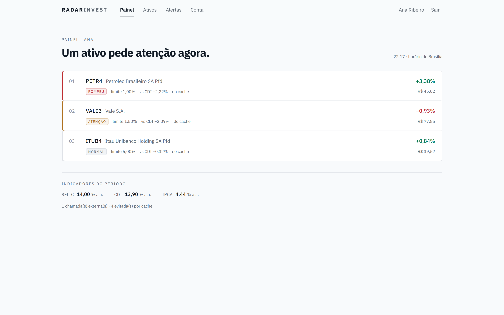

A leitura acontece pela borda esquerda. A **régua** codifica o nível de atenção;
a **cor do número** codifica a direção do movimento, seguindo a convenção que o
assessor já lê no home broker.

Os dois eixos são separados de propósito. PETR4 subiu 3,38% e rompeu um limite
de 1% — régua vermelha porque é crítico, número verde porque subiu. Se o nível
pintasse o número, uma alta apareceria em vermelho e a leitura de um segundo se
perderia.

O rodapé conta o custo do que você acabou de ver: chamadas externas feitas e
evitadas pelo cache.

### Cadastro de ativos

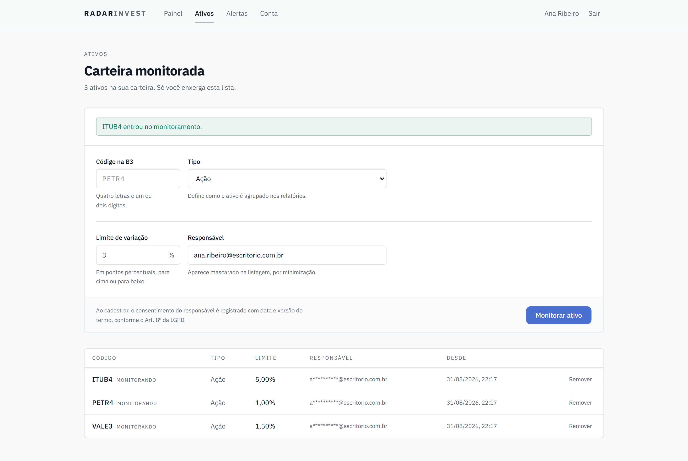

Repare no e-mail da tabela: `a**********@escritorio.com.br`. Sai mascarado
mesmo sendo o seu, por minimização.

### Alertas

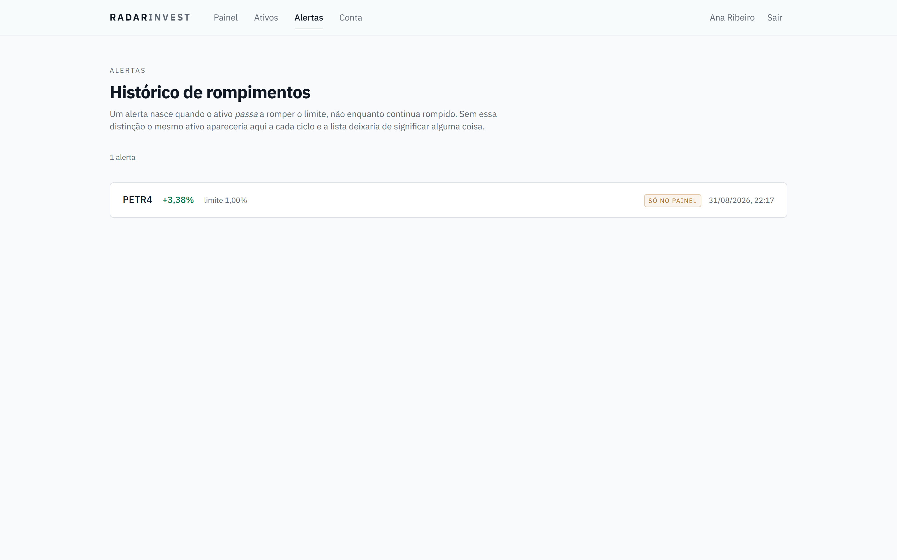

Um alerta nasce quando o ativo *passa* a romper o limite, não enquanto continua
rompido. A etiqueta diz se ele saiu para o canal externo ou ficou só no painel —
e diz a verdade: sem canal configurado, `notified` é `false`.

### Conta e direitos do titular

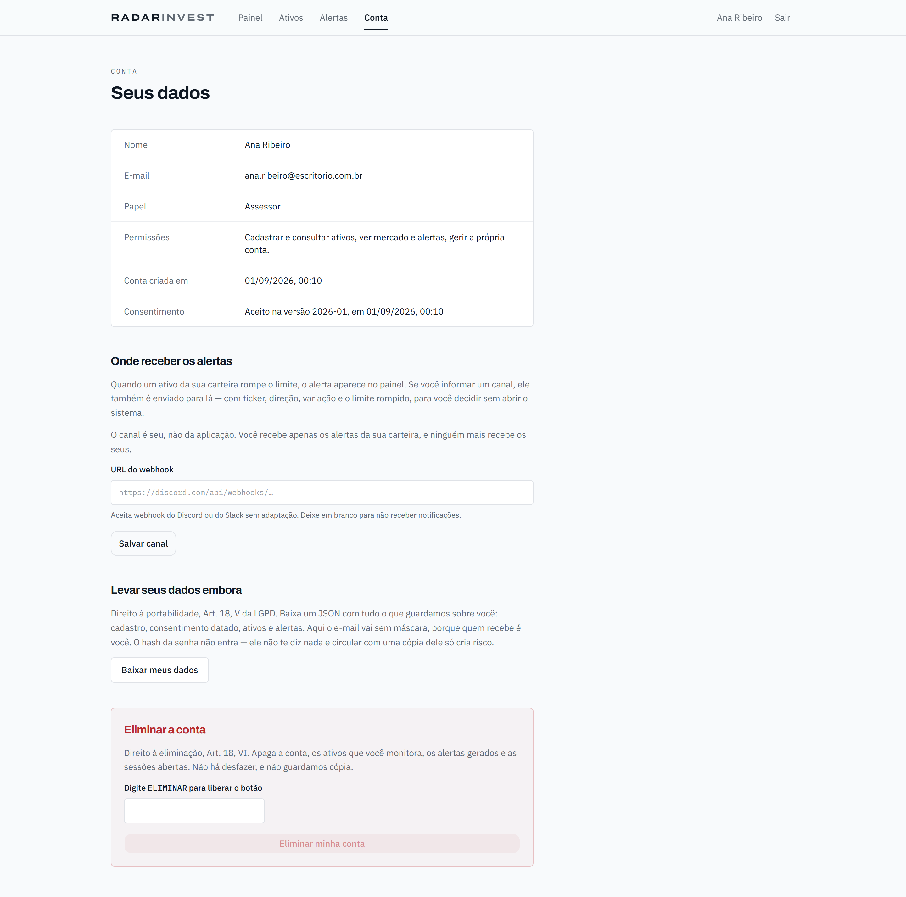

### Entrar e criar conta

<p align="center">
  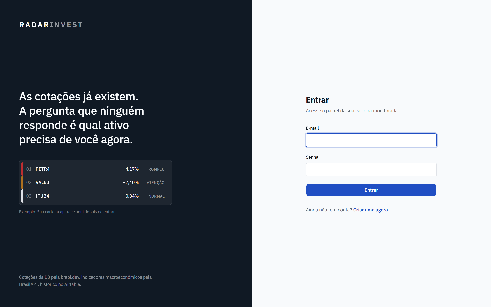
  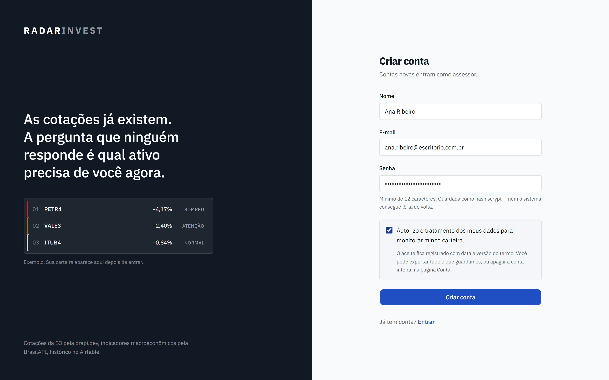
</p>

O painel da esquerda não é ilustração: é o próprio artefato do produto em
miniatura. Quem chega vê, antes de digitar qualquer coisa, o que vai receber
depois de entrar.

### Documentação viva e responsividade

<p align="center">
  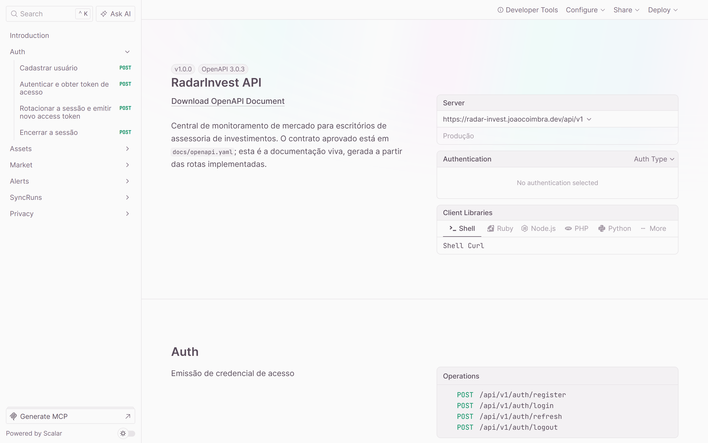
  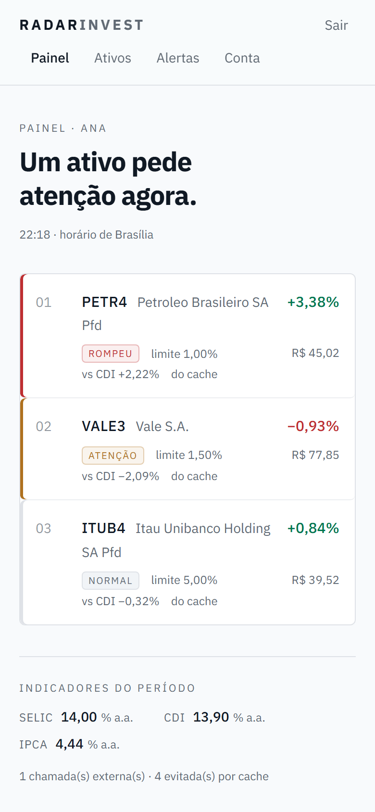
</p>

---

## APIs utilizadas

| API | Natureza | Autenticação | Papel |
|---|---|---|---|
| [brapi.dev](https://brapi.dev/docs) | Privada | Bearer Token | Cotações de ativos da B3 |
| [BrasilAPI](https://brasilapi.com.br/docs) | Pública | Nenhuma | SELIC, CDI e IPCA |
| [Airtable](https://airtable.com/developers/web/api/introduction) | Privada | Personal Access Token | Persistência no-code |

A escolha foi deliberada.

A **brapi** exige credencial, o que obriga o projeto a tratar proteção de chave,
cabeçalho `Authorization` e resposta 401 do provedor. A **BrasilAPI** não exige
nada, o que a torna adequada para dados abertos mas insuficiente sozinha para
sustentar uma aplicação de negócio. Ter as duas lado a lado torna a diferença
entre API pública e privada visível no próprio código, e não apenas na
documentação — o adaptador da BrasilAPI **não envia header de autorização**, e
isso está comentado no arquivo: mandar credencial para uma API que não pede é
vazar segredo sem ganhar nada.

O **Airtable** entra como banco no-code porque expõe API REST com o mesmo padrão
Bearer das outras duas, com escopo por base e token revogável pelo painel. Trocar
o banco não muda o conceito de autenticação.

### As restrições que moldaram o código

As limitações do Airtable não são detalhe de implementação — elas desenharam o
adaptador:

| Restrição da plataforma | Consequência no código |
|---|---|
| 5 requisições por segundo por base | Fila serial com intervalo mínimo de 210 ms |
| 429 bloqueia a base por 30 s | Espera fixa de 30 s no retry, não backoff curto |
| 10 registros por escrita | `create` e `update` fatiam a entrada em lotes |
| 100 registros por leitura | `list` pagina com `offset` até o fim |
| Cota mensal baixa | Cada chamada é contada e exposta no painel |

O plano gratuito da brapi dá 15.000 requisições por mês. Por isso os tickers vão
todos numa chamada só: **doze ativos custam uma requisição, não doze.**

---

## Fluxo de integração

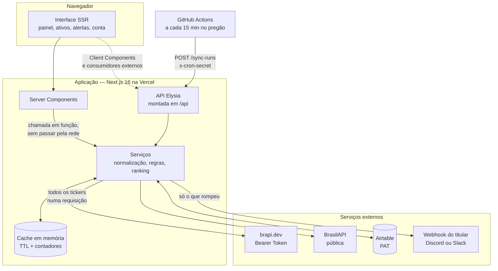

**Server Components não passam pela API HTTP.** Eles chamam a camada de serviço
direto, em função. Uma página do servidor conversando com a própria API pela rede
pagaria uma volta inteira de serialização para falar consigo mesma. A API existe
para Client Components, para o agendador e para consumidores externos.

### As etapas do ciclo

1. **Coleta** — consulta as duas APIs externas, servindo do cache o que ainda
   estiver dentro do TTL.
2. **Normalização** — os dois JSONs chegam com estruturas diferentes e são
   convertidos para um modelo interno único. Os adaptadores devolvem `Quote` e
   `Indicator`, nunca o JSON cru da origem: se a brapi renomear um campo, só o
   adaptador muda.
3. **Regras de negócio** — a variação de cada ativo é comparada ao limite
   configurado e ao CDI do período, produzindo um nível de atenção.
4. **Persistência** — grava no Airtable em lote, e **só o que mudou**.
5. **Alerta** — dispara no rompimento, para o canal do titular.

---

## O ciclo de sincronização

Este é o ponto que mais confunde, então vale separar: **o cron e o endpoint não
são alternativas.** O GitHub Actions faz um `curl` e vai embora; quem faz o
trabalho é o endpoint, dentro da aplicação, com acesso ao banco e às
credenciais.

Há dois caminhos que buscam cotação, e eles existem por razões diferentes:

| | Painel | Ciclo |
|---|---|---|
| Quando roda | quando você abre a página | de 15 em 15 min no pregão |
| Busca cotação | sim, ao vivo | sim |
| Grava histórico | **não** | sim |
| Gera alerta | **não** | sim |
| Serve para | ver o presente | vigiar enquanto você não olha |

Sem o painel buscar ao vivo, você veria dados de até 15 minutos atrás. Sem o
ciclo, você só saberia de um rompimento quando *lembrasse* de abrir a página — e
o produto existe justamente para avisar quando você não está olhando.

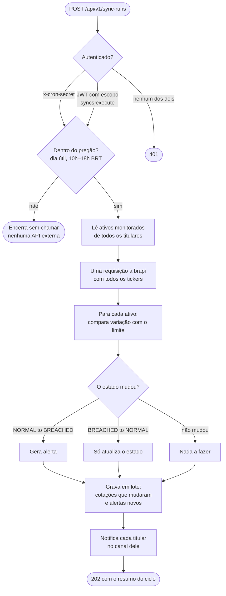

### Por que o alerta nasce na transição

Se o alerta dependesse do **estado** e não da **transição**, o mesmo ativo
alertaria a cada 15 minutos enquanto continuasse rompido. O assessor silenciaria
o canal — e perderia junto os alertas que importam.

É por isso que existe a coluna `alertState` na tabela `Assets`. Rode o ciclo duas
vezes seguidas e compare: na segunda, `alertsGenerated` é `0`.

### Por que dois modos de autenticação

Os dois chamadores têm naturezas diferentes:

| | ADMIN | Agendador |
|---|---|---|
| É | uma pessoa com sessão | uma máquina sem sessão |
| Prova identidade com | JWT de 15 min, renovável | segredo compartilhado |
| Pode fazer | tudo que um ADMIN faz | **só disparar o ciclo** |

Dar uma conta de ADMIN ao GitHub Actions seria pior: uma credencial capaz de ler
carteiras e exportar dados, guardada num secret de CI. O segredo dedicado
autoriza uma operação e nada mais.

O agendamento é a primeira barreira, não a única — a checagem de horário no
backend continua sendo a autoridade.

---

## Autenticação e segurança

O par de tokens é assimétrico de propósito.

| | Access token | Refresh token |
|---|---|---|
| Formato | JWT HS256 | 32 bytes aleatórios, opaco |
| Validade | 15 minutos | 7 dias |
| Onde vive | memória do cliente | cookie `httpOnly` |
| Guardado como | não é guardado | hash SHA-256 no banco |
| Revogável | **não** | **sim** |

O access token não é revogável: uma vez emitido, vale até expirar. A janela curta
é o que limita o estrago de um vazamento. O refresh token existe justamente para
ser revogável — por isso vive no banco.

Ele é guardado como **SHA-256**, não bcrypt ou argon2. Hash lento existe para
compensar a baixa entropia de senha escolhida por humano; 256 bits de
`randomBytes` não são passíveis de força bruta, e um KDF caro aqui só adicionaria
latência a cada rotação. O hash serve para que um vazamento da tabela não entregue
tokens utilizáveis.

### Rotação com detecção de reuso

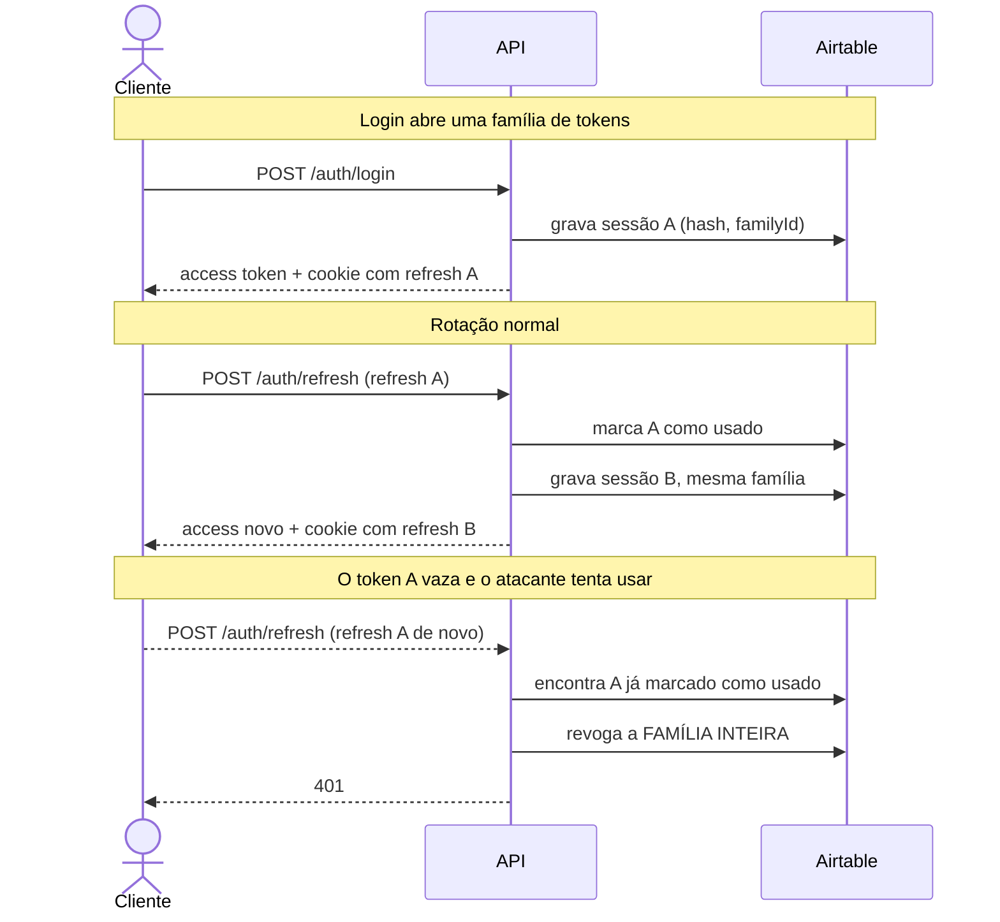

Se um token já usado reaparecer, só há duas explicações: ele vazou e o atacante
está usando, ou vazou e o dono está usando depois do atacante. Nos dois casos a
cadeia está comprometida, e a resposta correta é derrubar a família inteira —
revogar só o token apresentado deixaria a outra ponta viva.

A família expira sete dias depois do login e a rotação **não** estende esse prazo.
Caso contrário, uma sessão que rotacionasse a cada 15 minutos seria eterna.

### A ordem de verificação em toda rota protegida

```
validar token   → falha = 401
extrair identidade
checar escopo   → falha = 403
checar POSSE    → falha = 403 ou 404
consultar dados
filtrar resposta
```

A checagem de posse não é opcional. Sem ela a API fica exposta ao **BOLA**: um
usuário legitimamente autenticado acessando o recurso de outro. Token válido prova
identidade, **nunca** prova propriedade.

Na prática, o `ownerId` do token entra na consulta ao banco — nunca num filtro em
memória depois. Trazer a carteira inteira do escritório para descartar o que não é
do usuário gastaria cota e deixaria dado alheio passar pela aplicação sem
necessidade.

`GET /assets/{ticker}` de um ativo alheio devolve **404**, não 403. Devolver 403
confirmaria que aquele ticker existe na carteira de alguém.

### Limite de requisições

Janela fixa de 60 requisições por minuto, contada em memória, com duas chaves.

Rotas autenticadas contam pelo **id do usuário**: o limite acompanha a
identidade e não a rede, então trocar de rede não devolve cota e vários
assessores atrás do mesmo IP do escritório não disputam entre si.

Cadastro e login contam pelo **e-mail informado**, porque ali ainda não existe
identidade e o alvo de um ataque é uma conta específica. Contar por e-mail
limita o quanto uma conta pode ser martelada sem recorrer ao IP, que este
projeto decidiu não coletar.

A resposta traz o header `Retry-After` com os segundos restantes. Recusar sem
dizer quando tentar de novo empurra o cliente para uma repetição imediata.

### Papéis e escopos

| Papel | Escopos |
|---|---|
| `ASSESSOR` | `assets.read` `assets.write` `market.read` `alerts.read` `users.manage` |
| `ADMIN` | os mesmos, mais `syncs.execute` |

A conversão de papel em escopo acontece uma vez, na autenticação, e o token carrega
o resultado. Promover alguém a ADMIN só vale a partir do próximo login — e a
promoção é manual de propósito: conceder privilégio por autoatendimento anularia a
separação de papéis.

---

## Dados e LGPD

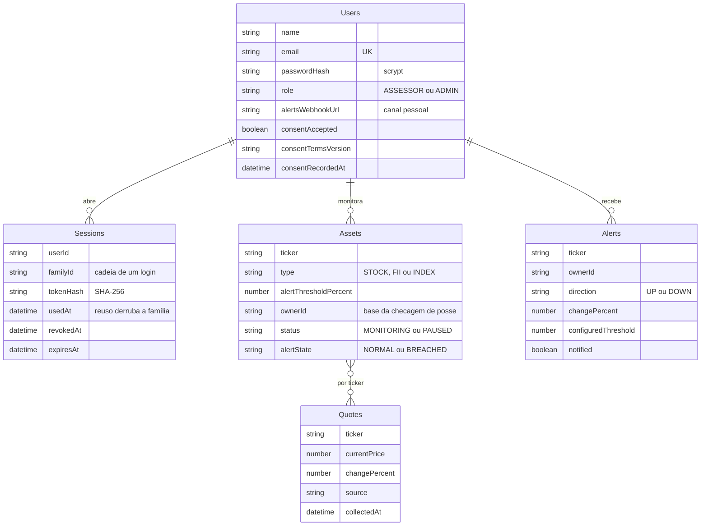

O Airtable não tem chave estrangeira: as relações acima são por identificador
gravado, e a integridade é responsabilidade da camada de serviço.

### Minimização aplicada no schema

A tabela `Sessions` **não guarda IP nem user-agent**. Seriam úteis para um painel
de "dispositivos conectados" que este projeto não tem. Sem uso definido, o dado
não é coletado — minimização é decisão de schema, não de tela.

O e-mail do responsável é mascarado na leitura (`a******@dominio`). A exceção é a
exportação, onde o destinatário é o próprio titular.

### Direitos implementados

| Artigo | Direito | Onde |
|---|---|---|
| Art. 8º | Consentimento | Registrado no cadastro com aceite, versão do termo e data |
| Art. 18, V | Portabilidade | `GET /users/{id}/export` e o botão em `/conta` |
| Art. 18, VI | Eliminação | `DELETE /users/{id}` e o botão em `/conta` |

A exportação devolve tudo o que a aplicação armazena, sem máscara — o destinatário
é o dono do dado. O `passwordHash` fica de fora: não diz nada ao titular, e
circular com uma cópia dele só cria risco.

A eliminação apaga conta, ativos, alertas e sessões. As sessões caem primeiro,
para que nenhuma credencial sobreviva ao registro que ela autenticava.

### O canal de alerta é por titular

Esta foi uma correção de desenho durante o desenvolvimento. A primeira versão
usava uma variável de ambiente única para o webhook — o que entregaria os alertas
de todos os usuários no mesmo lugar, e o assessor A descobriria quais ativos o
assessor B acompanha e com que limite.

Isso anularia, no último passo do fluxo, o mesmo isolamento que a API defende em
toda rota. **Vazamento no canal de saída é vazamento igual.**

Hoje cada titular configura o próprio canal em `/conta`. A variável global
sobreviveu com outro papel: canal de operação, que recebe apenas contagens —
nenhum ticker, nenhum titular, nenhum limite.

---

## Sustentabilidade digital

Toda requisição consome energia, e cota. Cotação do mesmo ativo pedida duas vezes
dentro da janela não justifica ida à origem.

- **Cache com TTL**, cache-aside, chaveado por ticker — não pelo conjunto, para
  que um ativo novo na carteira não invalide os que já estavam quentes.
- **Cotação que não mudou não vira linha nova** no banco. O ciclo devolve quantas
  gravou e quantas descartou.
- **Contadores expostos no painel.** Economia que ninguém mede é economia que
  ninguém acredita.

O número que aparece no rodapé do painel — *"1 chamada externa · 4 evitadas por
cache"* — é o mesmo `summary.callsAvoidedByCache` do contrato.

---

## Como executar

### Pré-requisitos

- [Bun](https://bun.sh) 1.3 ou superior
- Conta no [Airtable](https://airtable.com) com um Personal Access Token
- Token da [brapi.dev](https://brapi.dev)

### 1. Instalar

```bash
git clone https://github.com/joao-coimbra/radar-invest.git
cd radar-invest
bun install
```

### 2. Configurar o ambiente

```bash
cp .env.example .env.local
```

Preencha `BRAPI_TOKEN`, `AIRTABLE_TOKEN` e `AIRTABLE_BASE_ID`. Gere os dois
segredos:

```bash
bun -e "const c=require('crypto');console.log('JWT_SECRET='+c.randomBytes(48).toString('base64'));console.log('CRON_SECRET='+c.randomBytes(32).toString('hex'))"
```

O Personal Access Token precisa de quatro escopos: `data.records:read`,
`data.records:write`, `schema.bases:read` e `schema.bases:write`. Em *Access*,
adicione **apenas** a base do projeto.

### 3. Conferir e criar as tabelas

```bash
bun run check:airtable
```

Diagnóstico somente-leitura. Separa os três erros que se parecem — token inválido,
escopo faltando e base inacessível — e diz qual é.

```bash
bun run setup:airtable
```

Cria as cinco tabelas com os tipos corretos pela Metadata API: datas em ISO/UTC,
números com duas casas, selects com as opções do contrato. É idempotente.

### 4. Rodar

```bash
bun run dev
```

A aplicação sobe em `http://localhost:3000` e a documentação viva em
`http://localhost:3000/api/docs`.

Se faltar alguma variável, o servidor **não sobe** e a mensagem nomeia a chave —
a validação roda no `instrumentation.ts`, o hook que o Next executa uma vez antes
de aceitar a primeira requisição.

### Testar o ciclo fora do pregão

Fora de dia útil entre 10h e 18h de Brasília, o ciclo encerra sem chamar nenhuma
API externa. Para demonstrar:

```bash
MARKET_OPEN_HOUR=0 MARKET_CLOSE_HOUR=24 bun run dev
```

E dispare como o agendador faz:

```bash
curl -X POST http://localhost:3000/api/v1/sync-runs -H "x-cron-secret: SEU_CRON_SECRET"
```

No PowerShell, use `curl.exe` — `curl` lá é apelido de `Invoke-WebRequest`.

### Verificar a API

```bash
bun run smoke:api
```

Percorre as oito rotas protegidas sem credencial e com credencial inválida,
testa os dois modos de autenticação do agendador, confirma que o token não é
aceito por query string e confere os caminhos publicados na documentação.
Aceita uma URL como argumento para rodar contra produção.

Ele existe por causa de um defeito real: uma mudança na extração do token fez
seis das oito rotas devolverem 500 no lugar de 401, e a verificação da época
cobria apenas duas.

### Automação em produção

O agendador é um workflow do GitHub Actions, em
[`.github/workflows/sync-market.yml`](.github/workflows/sync-market.yml). Ele
precisa de dois secrets no repositório:

| Secret | Valor |
|---|---|
| `APP_URL` | a URL do deploy, sem barra no fim |
| `CRON_SECRET` | o mesmo do `.env.local` |

GitHub Actions e não cron da Vercel porque o plano Hobby executa cron **uma vez
por dia** — um monitor de mercado com essa frequência não monitora nada. E o
workflow no repositório é artefato revisável, não configuração invisível.

O botão *Run workflow* na aba Actions dispara o ciclo na hora.

---

## Stack e estrutura

Next.js 16 (App Router) · TypeScript · Tailwind 4 · shadcn sobre Base UI ·
Elysia · TypeBox · Zod · jose · Airtable · Bun

```
src/
├── app/
│   ├── (auth)/login  (auth)/register     ← telas públicas
│   ├── (app)/dashboard  assets  alerts  account
│   ├── api/[[...slugs]]/route.ts         ← ponto de entrada do Elysia
│   └── actions.ts                        ← Server Actions
├── server/
│   ├── routes/         ← rotas Elysia, uma por recurso
│   ├── services/       ← normalização, regras de negócio, ranking
│   ├── repositories/   ← acesso às tabelas do Airtable
│   ├── integrations/   ← um adaptador por API externa
│   ├── auth/           ← JWT, senha, sessões, escopos, guard
│   └── lib/            ← env, cache, http, erros, máscara, rate limit
└── instrumentation.ts  ← valida o ambiente no boot

docs/openapi.yaml       ← o contrato, escrito antes da implementação
scripts/                ← setup do Airtable, verificação da API, prints, PDF
```

### API First

O contrato em [`docs/openapi.yaml`](docs/openapi.yaml) foi escrito **antes** da
implementação e é a fonte da verdade: endpoints, schemas, códigos de erro e regras
de negócio. O contrato descreve o combinado; o código faz cumprir; o consumidor
segue.

A documentação em `/api/docs` é gerada a partir das rotas implementadas, o que
permite comparar o combinado com o entregue.

Todos os erros usam o mesmo envelope:

```json
{ "success": false, "code": "UNAUTHENTICATED", "message": "Não foi possível confirmar sua identidade." }
```

O `code` é estável e legível por máquina — é ele que o consumidor lê para decidir
o tratamento. A `message` é para humanos e nunca expõe detalhe interno: erro
desconhecido vira `INTERNAL_ERROR` com mensagem genérica, e o original vai para o
log. Stack trace devolvido ao cliente é um mapa da aplicação entregue a quem
estiver sondando.

---

## Decisões que valem registro

**`Bun.password.hash()` não funciona aqui.** O `next dev` respeita o shebang do
binário do Next e sobe **Node**, mesmo invocado por `bun run dev` — medido:
`typeof Bun === "undefined"` dentro de um route handler. Na Vercel seria Node de
qualquer forma. A substituição é `scrypt` do `node:crypto`: KDF de senha de
verdade, memory-hard como o argon2, sem dependência nativa. O hash guarda os
parâmetros junto (`scrypt$16384$8$1$salt$hash`), para permitir endurecer o custo
no futuro sem invalidar as senhas existentes.

**O build não pode depender de segredo de runtime.** O `next build` percorre o
grafo de módulos para coletar dados das páginas. Com a validação de ambiente no
topo do arquivo, o build inteiro passava a exigir as credenciais — e na Vercel
quebrava de vez com variáveis marcadas como *Sensitive*, que por desenho só
existem em runtime. Hoje o `env` valida no primeiro acesso a uma chave, e o
`instrumentation.ts` força a validação no boot.

**Um bug que só existia em produção.** As rotas protegidas devolviam 500 em vez
de 401. O Elysia decide por análise estática quais campos do contexto montar, e no
modo compilado ele não enxergava o uso de `headers` dentro do `resolve` de uma
macro — o campo chegava `undefined` e o 401 virava `TypeError`. Em desenvolvimento
não aparecia, porque lá o modo é dinâmico. A extração do bearer token passou para
o plugin `@elysiajs/bearer`, que registra um `derive` global.

**O cookie de refresh usa `Path=/` e `SameSite=Lax`.** O desenho original pedia
`Path=/api/v1/auth` e `Strict`, mas a interface é renderizada no servidor e
precisa do cookie nas navegações de página, que `Strict` bloquearia. `Lax`
continua barrando POST cross-site, que é o vetor de CSRF que importa aqui.

**Renderizar uma tela não consome uma rotação.** Os Server Components resolvem a
identidade pelo cookie sem rotacionar o refresh token. Duas requisições paralelas
do navegador rotacionariam duas vezes, a segunda veria a primeira como usada, e a
família cairia por um falso positivo de reuso.

---

## Créditos

Desenvolvido por [João Coimbra](https://github.com/joao-coimbra) como trabalho
final da disciplina de Integração de APIs.

Os prints deste README são gerados por
[`scripts/capture-screenshots.mjs`](scripts/capture-screenshots.mjs), que sobe uma
conta de demonstração, cadastra os ativos, dispara um ciclo, fotografa e apaga a
conta pela própria tela de eliminação.
